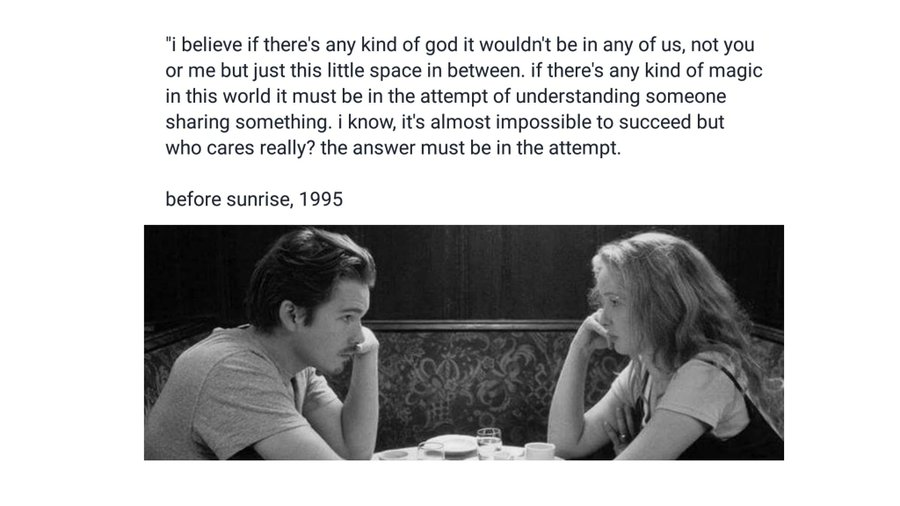

## Breve Carta Sobre Amores

Às vezes, tudo se desenrola rápido demais que não tiramos um tempo para fechar nossos olhos e entender tudo que acabou de se passar.
Fecha teus olhos e, primeiramente, agradece. Agradece por ele, por ela, pelas marcas que te deixou, pelas lágrimas, pelas músicas dedicadas, pelos beijos demorados e pelos rápidos também. Agradece por toda a sua história, pelos olhares sinceros e profundos, pelas carícias...

Isso tudo é compartilhado. Isso tudo faz parte de vocês.
E vai continuar fazendo, mesmo que você se esforce muito para esquecer... A conexão sempre deixa marcas.

E essas marcas, essas lembranças... Podem ser guardadas no local mais escuro de seu ser, largadas, onde você evita ao máximo abrir as gavetas e desempoeirar...
Ou podem ser expostas em cima de suas prateleiras, com a emolduração mais bonita que achares, como relíquias.
Em um relacionamento sempre há relíquias, coisas que já se foram e que guardamos com algum carinho, esteja o relacionamento ainda vivo ou não.

Aquela sensação efêmera...
a sensação da palpitação no coração,
da curiosidade inicial,
uma ansiedade por ainda não saber e querer ter tudo, sem limitações, o mais rápido possível...
a sensação do olhar desviado,
do sorriso de lado, meio reprimido.
Ah... Os pequenos gestos...
E os grandes gestos! As grandes declarações... 
Tão belas, mas também tão leves, são como faíscas.

Elas vêm e somem. Mas voltam! Não conseguimos segurá-las, mas elas não servem para isso, não existem para sempre apreendidas, elas existem para serem sentidas, admiradas, para trazer a beleza inexplicável, divina, para trazer isso que chamamos de conexão.

Uma relação não se sustenta dessas faíscas, entretanto. São *iluminadas* por elas.
As tornam mais leves, pois há peso em relações. 
ornam elas mais belas, pois às vezes é difícil de enxergar a beleza em meio a tanta confusão, no meio de tanto caos...
Sim, essas faíscas, essas palpitações nos relembram do porquê gostamos tanto de estar aqui, junto a esse outro ser vivo.

Alimente suas faíscas, mas saiba que não são elas que criam o espaço da vida numa relação.

É preciso haver espaço para a liberdade, uma relação não é uma prisão, ao menos, se há amor, não deve ser.
O amor liberta.
Essa, para mim, é a sua principal função.
Um relacionamento amoroso, na sua própria designação, quer dizer um relacionamento que liberta o outro.

Relacionamento, do latim relatio -  relatio: o ato de relatar ou narrar alguma situação, de trazer alguma coisa de volta.
Trazer à tona algo, novamente.

Uma das maiores bençãos que vejo em um relacionamento é exatamente por ele criar esse espaço de ser!
Ser livre e ser visto pelo outro, sem amarras e sem medo de qualquer julgamento, mesmo que haja esses julgamentos... O medo não existe, pois se há certeza do amor.
Não devo ter medo se sei que terei acolhimento. Sei que terei toda a liberdade do mundo, pois há amor.

E que gostoso é estar numa relação amorosa! Onde há tanta liberdade para simplesmente ser quem és e sendo trazida à tona, novamente... E novamente! Que gostoso é ter esse olhar junto ao teu e ter a certeza que esse olhar vai estar ali, te dando toda a liberdade para você ser como é, te aceitando, te amando e te buscando, sempre.

Duas pessoas devem, em uma boa relação, crescerem juntas. Para isso, o caminho que desejam seguir e a forma que desejam usar a sua liberdade, devem ser compatíveis, devem convergir.
Caminhos muito divergentes, mesmo que com bastante amor, não conseguem estar trazendo um e o outro à tona... Acabam por estar longe demais para isso, indo para posições contrárias. Mesmo com muito amor.
---
Que olhar faz teu coração sentir-se em expansão?
Que olhares te fazem sentir retraída(o)?
Quem te traz paz?
Quem te faz sentir grande? Aliás, te lembra que és grande?
---
E você... Que quer ser esse olhar para alguém... Você ama?
Você dá a liberdade para a pessoa ser quem é?
Dá a liberdade da pessoa ser feliz e fazer o que quer?
Ou você está completamente apegado ao medo de perder alguém?
---
A restrição não cabe no amor, e sim, é tão difícil amar dessa forma... É um desapego do ego, talvez.
É o amor que se desprende da ideia de *ter* alguém, que se desprende do *controle*.
É o amor verdadeiro que te deixa vulnerável ao outro.
Deixa-o completamente livre para vir e abraçar, para entrar em ti, nos seus pensamentos, nos seus sonhos, nas viagens mais aleatórias que suas mentes vão conseguir imaginar, mas também é deixar completamente livre para o outro se afastar, se assim desejar.
Ai... Esse amor pode ferir, fazer você chorar por meses, anos... Mas é o único amor que vale a pena (na minha opinião) a ser vivido em uma relação.
É uma amor grandioso e eu acredito que todos nós merecemos esse tipo de amor.
Pelo menos é o amor que desejo para mim.

Portanto, tira um tempo para fechar os teus olhos e pensar e agradecer.
Agradecer se esse amor chegou, se já foi embora... Se ainda vai chegar.
E lembra de tudo que aconteceu, lembra da tua história com esse amor.
Pensa nas marcas que te deixou.
E pensa se você sente-se livre junto a esse amor, se o espaço entre vocês, essa conexão, está expandido quem és, está te fazendo sentir livre e se você está fazendo o outro sentir-se livre e forte também.

Agradece por tudo.

Por fim, vou deixar aqui uma poesia que gosto muito.
(com uma recitação maravilhosa!)

https://www.youtube.com/watch?v=cPG6nJRJeWQ

Espero que tenha ajudado um pouco :)